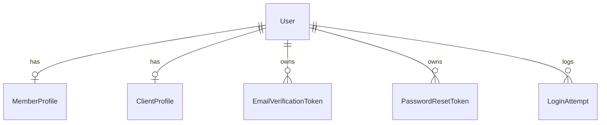
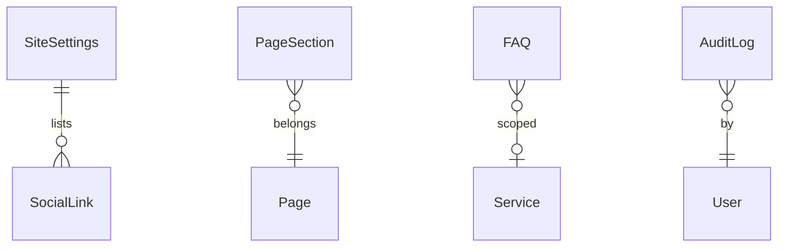
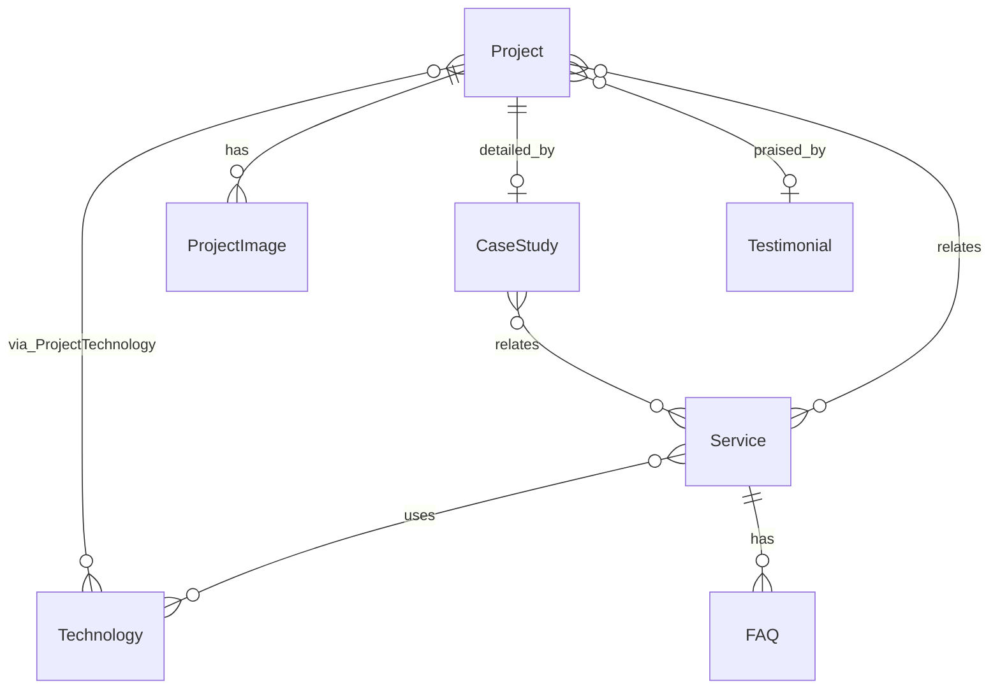
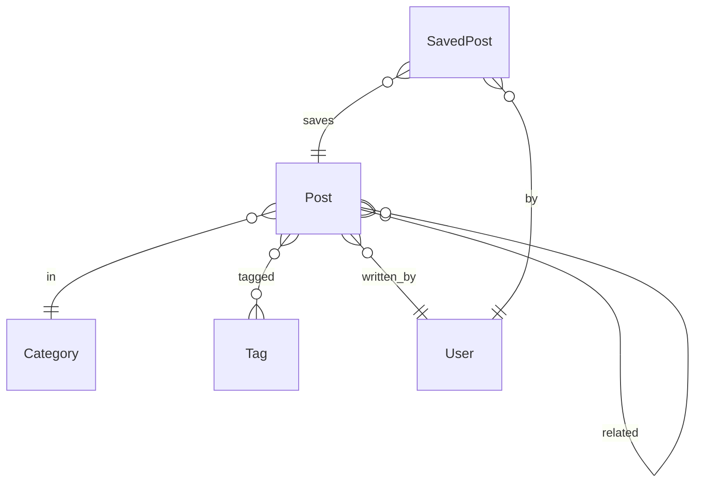
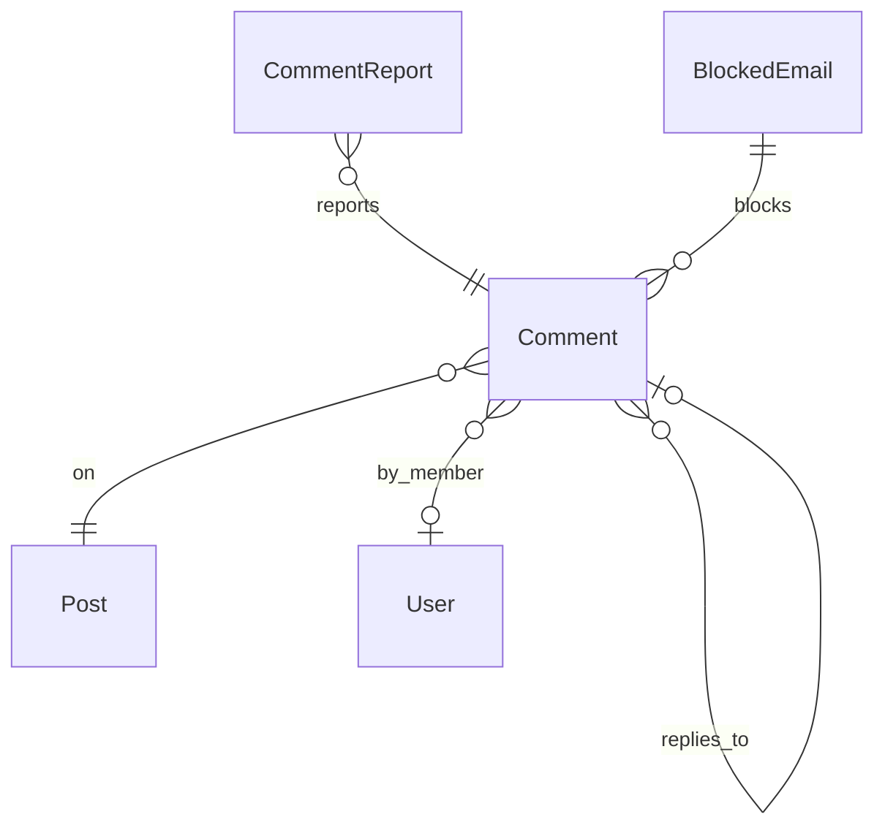
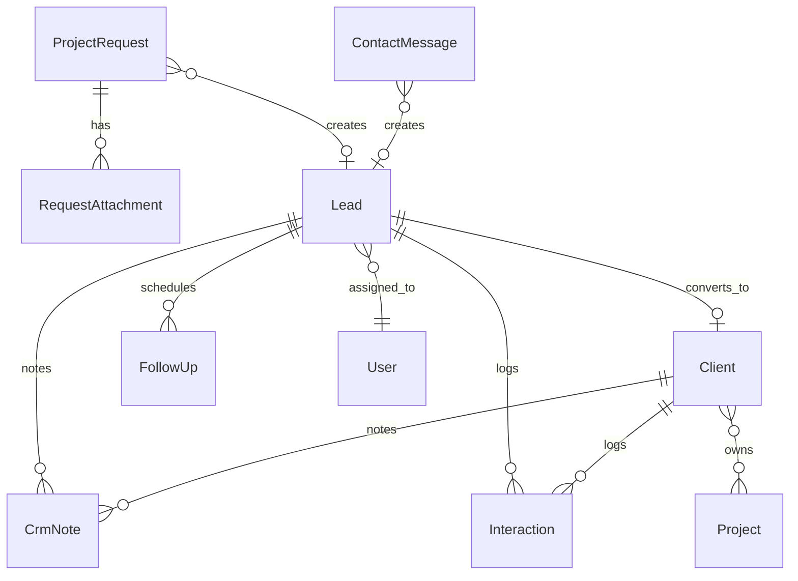

# نموذج البيانات — ERD الكامل

## 0. النماذج المجردة المشتركة

تُعرَّف مرة واحدة في `core/models/base.py` وترثها بقية النماذج، فتمنع تكرار الحقول في 40 نموذجًا.

```python
TimeStampedModel     created_at, updated_at
AuthoredModel        created_by → User, updated_by → User
PublishableModel     is_published, published_at
OrderableModel       display_order
ActivatableModel     is_active
SEOModel             seo_title_ar/en, seo_description_ar/en, og_image → MediaFile
SearchableModel      search_text                (يُملأ آليًا عند الحفظ)
ViewCountModel       view_count
TranslatableMixin    يوفّر obj.title / obj.description حسب لغة الطلب
```

### كيف تعمل `TranslatableMixin`

```python
class TranslatableMixin:
    translatable_fields = ()      # مثال: ("title", "description")

    def tr(self, field, lang=None):
        lang = lang or get_current_language()      # من middleware
        value = getattr(self, f"{field}_{lang}", "")
        return value or getattr(self, f"{field}_ar", "")   # ارتداد للعربية
```

في المسلسلات، حقل `TranslatedField` مخصص يحل الحقل تلقائيًا حسب `Accept-Language`، مع وضع `?full=true` لإرجاع اللغتين معًا (تستخدمه لوحة التحكم في نماذج التحرير).

### قاعدة الـ Slug

- `slug` **واحد لاتيني** لكل كيان، يخدم `/ar/...` و`/en/...` معًا.
- يُولَّد من `title_en` إن وُجد، وإلا من نقحرة `title_ar`.
- فريد على مستوى النموذج، ويُثبَّت بعد النشر (تغييره يُنشئ `Redirect` تلقائيًا).

---

## 1. نطاق `accounts`



**User** — يرث `AbstractBaseUser` + `PermissionsMixin`، والبريد هو `USERNAME_FIELD`.

| الحقل | النوع | ملاحظات |
|---|---|---|
| `email` | Email | فريد، معرّف الدخول |
| `full_name` | Char | |
| `phone` | Char | اختياري |
| `avatar` | FK → MediaFile | اختياري |
| `role` | Choice | `super_admin, content_manager, editor, crm_manager, marketing_manager, member, client` |
| `preferred_language` | Choice | `ar, en` |
| `is_email_verified` | Bool | |
| `is_active`, `is_staff` | Bool | `is_staff` = صلاحية دخول لوحة التحكم |
| `last_login_ip` | GenericIP | |

> `role` حقل عرض وتيسير؛ **مصدر الحقيقة للصلاحيات هو مجموعات Django** (`Group` + `Permission`). حفظ المستخدم يزامن مجموعته مع دوره.

**MemberProfile** — `user` O2O · `bio_ar/en` · `website` · `country` · `city` · `newsletter_opt_in` · `notify_on_comment_reply` · `avatar`

**ClientProfile** — `user` O2O · `client` FK → `crm.Client` — الجسر الذي يحوّل عضوًا إلى عميل لاحقًا دون تغيير بنيوي.

**EmailVerificationToken / PasswordResetToken** — `user` · `token` (فريد، عشوائي 64) · `expires_at` · `used_at` · `ip`

**LoginAttempt** — `email` · `ip` · `success` · `user_agent` · `created_at` — أساس تحديد المعدل والقفل المتدرج.

---

## 2. نطاق `core`



**SiteSettings** (سجل واحد — Singleton)

| المجموعة | الحقول |
|---|---|
| الهوية | `site_name_ar/en`, `tagline_ar/en`, `logo_light`, `logo_dark`, `favicon` |
| المالك | `owner_name_ar/en`, `owner_title_ar/en`, `owner_bio_ar/en`, `owner_photo`, `cv_ar`, `cv_en` |
| التواصل | `email`, `phone`, `whatsapp`, `whatsapp_default_message_ar/en`, `address_ar/en`, `country`, `city` |
| التشغيل | `default_language`, `default_theme`, `timezone`, `currency` |
| الصيانة | `maintenance_mode`, `maintenance_message_ar/en` |
| التحليلات | `analytics_provider`, `analytics_site_id` |
| البريد | `email_from_name`, `email_from_address` (الأسرار في `.env`) |

**SEOSettings** (Singleton) — `default_seo_title_ar/en` · `default_seo_description_ar/en` · `default_og_image` · `robots_txt` · `twitter_handle` · `google_verification` · `bing_verification`

**SocialLink** — `platform` (choice) · `url` · `display_order` · `is_active`

**PageSection** — يتحكم في أقسام الصفحات من اللوحة.

| الحقل | ملاحظات |
|---|---|
| `page` | `home, about, services, contact, ...` |
| `key` | `hero, intro, stats, services, solutions, projects, case_studies, process, technologies, testimonials, posts, newsletter, cta` |
| `title_ar/en`, `subtitle_ar/en` | نصوص القسم |
| `is_visible` | إظهار/إخفاء يدوي |
| `display_order` | الترتيب (سحب وإفلات في اللوحة) |
| `config` | JSON — إعدادات خاصة بالقسم (عدد العناصر، نمط العرض، الأزرار) |
| `auto_hide_when_empty` | افتراضيًا `True` |

**Stat** — `label_ar/en` · `value` · `suffix` · `icon` · `display_order` · `is_active` (قسم الإحصائيات)

**FAQ** — `question_ar/en` · `answer_ar/en` · `scope` (`global, service, solution`) · `service` FK اختياري · `display_order` · `is_active`

**Redirect** — `old_path` · `new_path` · `status_code` (301/302) · `hits` — يُنشأ آليًا عند تغيير slug منشور.

**AuditLog** — `user` · `action` (`create, update, delete, login, logout, publish, export`) · `model_name` · `object_id` · `object_repr` · `changes` (JSON قبل/بعد) · `ip` · `user_agent` · `created_at`

---

## 3. نطاق `portfolio`



**Technology**
`name` · `slug` · `category` (`language, frontend, backend, mobile, desktop, database, tool`) · `icon` · `color` · `description_ar/en` · `proficiency` (1–5) · `is_featured` · `display_order` · `is_active`

**Service** — نموذج واحد للخدمات والحلول القطاعية.

| الحقل | ملاحظات |
|---|---|
| `kind` | `service` (خدمة تطويرية) · `solution` (حل قطاعي) — يحدد المسار `/services` أو `/solutions` |
| `sector` | `education, retail, restaurants, accounting, hr, real_estate, pharmacy, ngo, general` |
| `title_ar/en`, `slug` | |
| `short_description_ar/en` | للبطاقات |
| `description_ar/en` | Markdown — المحتوى الكامل |
| `icon`, `cover_image` | |
| `features` | JSON: `[{title_ar, title_en, description_ar, description_en, icon}]` |
| `deliverables` | JSON: قائمة المخرجات |
| `price_from`, `price_currency`, `price_note_ar/en` | نطاق سعري إرشادي |
| `duration_estimate_ar/en` | مدة التنفيذ التقديرية |
| `technologies` | M2M → Technology |
| `related_projects` | M2M → Project |
| `is_featured`, `is_published`, `display_order` | |
| + `SEOModel`, `SearchableModel`, `ViewCountModel` | |

> **قاعدة النشر:** `is_published` لا يُقبل إلا إذا تجاوز `description` حدًا أدنى (~600 كلمة) ووُجدت `features` وغلاف. يُطبَّق في `clean()` وفي المسلسل.

**Project**

| الحقل | ملاحظات |
|---|---|
| `title_ar/en`, `slug` | |
| `summary_ar/en` | وصف مختصر للبطاقة |
| `description_ar/en` | Markdown |
| `sector`, `project_type` | `web, mobile, desktop, api, system, other` |
| `client_name`, `client_permission`, `is_anonymized` | ضبط عرض هوية العميل |
| `cover_image`, `video_url` | |
| `technologies` | M2M عبر `ProjectTechnology` |
| `live_url`, `github_url`, `play_store_url`, `app_store_url` | |
| `completed_at`, `status` | `planning, in_progress, completed, maintained, archived` |
| `is_featured`, `is_published`, `display_order` | |
| + SEO / Searchable / ViewCount | |

**ProjectImage** — `project` · `image` → MediaFile · `caption_ar/en` · `display_order`
**ProjectTechnology** — `project` · `technology` · `role` (`primary, secondary`)

**CaseStudy** — O2O مع `Project`

`title_ar/en` · `slug` · `overview_ar/en` · `problem_ar/en` · `requirements_ar/en` · `challenges_ar/en` · `solution_ar/en` · `architecture_ar/en` · `diagram_image` (UML/ERD) · `development_phases` (JSON: `[{title_ar,title_en,description_ar,description_en,duration}]`) · `results_ar/en` · `metrics` (JSON: `[{label_ar,label_en,value,suffix}]`) · `lessons_ar/en` · `testimonial` FK · `related_services` M2M · `is_published` · SEO · ViewCount

**Testimonial** — `client_name_ar/en` · `client_title_ar/en` · `company_ar/en` · `avatar` · `content_ar/en` · `rating` (1–5) · `project` FK اختياري · `proof_url` (رابط LinkedIn أو ما يثبت الشهادة) · `is_featured` · `is_published` · `display_order`

**Experience** — `title_ar/en` · `organization_ar/en` · `location_ar/en` · `start_date` · `end_date` · `is_current` · `description_ar/en` · `display_order`

**Education** — `degree_ar/en` · `institution_ar/en` · `field_ar/en` · `start_date` · `end_date` · `description_ar/en` · `display_order`

**Certification** — `name_ar/en` · `issuer_ar/en` · `issue_date` · `expiry_date` · `credential_id` · `credential_url` · `image` · `display_order`

**Resource** — `title_ar/en` · `slug` · `description_ar/en` · `type` (`pdf, link, tool, template`) · `file` · `url` · `cover_image` · `requires_membership` · `download_count` · `is_published` · `display_order`

**ProcessStep** — `title_ar/en` · `description_ar/en` · `icon` · `duration_ar/en` · `deliverables` (JSON) · `display_order` (صفحة «طريقة العمل»)

---

## 4. نطاق `blog`



**Category** — `name_ar/en` · `slug` · `description_ar/en` · `color` · `display_order` · `is_active`
**Tag** — `name_ar/en` · `slug` · `usage_count`

**Post**

| الحقل | ملاحظات |
|---|---|
| `title_ar/en`, `slug` | |
| `excerpt_ar/en` | الملخص |
| `content_ar/en` | Markdown |
| `cover_image`, `og_image` | |
| `author` | FK → User |
| `category` | FK |
| `tags` | M2M |
| `reading_time_ar`, `reading_time_en` | يُحسبان آليًا عند الحفظ |
| `status` | `draft, in_review, scheduled, published, archived` |
| `published_at` | تاريخ النشر أو موعد النشر المجدول |
| `is_featured`, `allow_comments` | |
| `related_posts` | M2M ذاتي (اختياري — وإلا تُقترح آليًا بالتصنيف والوسوم) |
| + SEO / Searchable / ViewCount | |

> **النشر المجدول:** `status=scheduled` مع `published_at` مستقبلي؛ مهمة `django-q2` كل 5 دقائق تنقلها إلى `published`.

**SavedPost** — `user` · `post` · `created_at` — قيد فرادة على (user, post).

---

## 5. نطاق `comments`



**Comment**

| الحقل | ملاحظات |
|---|---|
| `post` | FK |
| `parent` | FK ذاتي — الردود (مستويان كحد أقصى) |
| `user` | FK اختياري — عضو مسجل |
| `guest_name`, `guest_email` | للزائر غير المسجل |
| `content` | نص عادي، يُنقّى من HTML |
| `status` | `pending, approved, rejected, spam` |
| `notify_on_reply` | إشعار صاحب التعليق عند الرد |
| `ip`, `user_agent` | للتدقيق ومكافحة السبام |
| `approved_by`, `approved_at` | |
| `created_at` | |

> `guest_email` **لا يُعاد أبدًا** في أي استجابة عامة — يُستثنى على مستوى المسلسل، لا بالإخفاء في الواجهة.

**آليات مكافحة السبام (متتالية):**
1. حقل خادع (honeypot) مخفي — امتلاؤه = رفض صامت.
2. حد زمني أدنى بين تحميل النموذج والإرسال (< 3 ثوانٍ = مشبوه).
3. تحديد معدل: 3 تعليقات / ساعة لكل IP، و5 لكل بريد.
4. مطابقة قائمة `BlockedEmail`.
5. مرشّح كلمات وروابط (> 2 رابط = `spam` تلقائيًا).
6. المراجعة اليدوية — لا يظهر أي تعليق قبل الاعتماد.

**CommentReport** — `comment` · `reporter` FK اختياري · `reporter_email` · `reason` (`spam, offensive, off_topic, other`) · `note` · `status` (`open, resolved, dismissed`) · `created_at`

**BlockedEmail** — `value` (بريد كامل أو نطاق مثل `@spam.com`) · `reason` · `blocked_by` · `created_at`

---

## 6. نطاق `crm`



**ContactMessage** — `name` · `email` · `phone` · `subject` · `message` · `language` · `status` (`new, read, replied, archived`) · `ip` · `lead` FK اختياري · `created_at`

**ProjectRequest**

| المجموعة | الحقول |
|---|---|
| المرجع | `reference_code` (مثل `REQ-2026-0042`) |
| الخطوة 1 | `project_type`, `sector` |
| الخطوة 2 | `requirements` (JSON): `has_design, has_backend, has_existing_app, needs_android, needs_ios, needs_offline, needs_notifications, needs_payments, needs_multi_branch, expected_users` · `description` · `budget_range` · `timeline` |
| الخطوة 3 | `name, email, phone, whatsapp, company, country, city, preferred_language` |
| النظام | `status` (9 حالات) · `source` · `ip` · `assigned_to` · `lead` FK · `created_at` |

حالات الطلب: `new, reviewed, contacted, meeting_scheduled, proposal_sent, accepted, in_progress, completed, rejected`

> **الحفظ الجزئي:** يُنشأ السجل بعد الخطوة الأولى بحالة `draft` مع `session_key`، ويُستكمل لاحقًا. حتى الطلب المهجور يترك أثرًا قابلًا للمتابعة.

**RequestAttachment** — `request` · `file` · `original_name` · `size` · `mime_type`

**Lead**

`name` · `company` · `email` · `phone` · `whatsapp` · `country` · `city` · `source` (`website_form, contact_form, whatsapp, referral, social, direct, other`) · `services` M2M → Service · `expected_budget` · `notes` · `first_contact_at` · `last_contact_at` · `next_follow_up_at` · `owner` FK → User · `priority` (`low, medium, high, urgent`) · `status` · `member` FK اختياري (عضو تحوّل إلى Lead) · `created_at`

حالات العميل المحتمل: `new, contacted, waiting, negotiating, proposal_sent, accepted, in_progress, completed, long_term, rejected, archived`

**Client** — `lead` O2O اختياري · `user` O2O اختياري · `name` · `company` · `email` · `phone` · `whatsapp` · `country` · `city` · `notes` · `projects` M2M → Project · `client_since` · `total_value` · `is_active`

**CrmNote** — `lead` FK اختياري · `client` FK اختياري · `content` · `created_by` · `created_at` *(قيد: أحد الحقلين مطلوب)*

**Interaction** — `lead`/`client` · `type` (`call, whatsapp, email, meeting, other`) · `direction` (`inbound, outbound`) · `summary` · `occurred_at` · `created_by`

**FollowUp** — `lead`/`client` · `title` · `due_at` · `notes` · `status` (`pending, done, missed`) · `assigned_to` · `reminder_sent`

**CrmAttachment** — `lead`/`client` · `file` · `name` · `uploaded_by`

---

## 7. نطاق `newsletter`

```mermaid
erDiagram
    Subscriber }o--o{ Interest : prefers
    Subscriber }o--o| User : linked
    Campaign }o--o| EmailTemplate : uses
    Campaign ||--o{ CampaignRecipient : targets
    CampaignRecipient }o--|| Subscriber : to
```

**Interest** — `key` · `name_ar/en` · `description_ar/en` · `display_order`
القيم الثابتة: `new_projects, new_services, articles, offers, product_updates`

**Subscriber**

`email` (فريد) · `name` · `language` · `interests` M2M → Interest · `status` (`pending, active, unsubscribed, bounced, complained`) · `source` (`footer, home, blog_post, popup, manual, member_signup`) · `confirm_token` · `confirmed_at` · `unsubscribe_token` (دائم، موقّع) · `consent_ip` · `consent_at` · `user` FK اختياري · `created_at`

**Double Opt-in:** الاشتراك يُنشأ بحالة `pending` → بريد تحقق برابط موقّع صالح 48 ساعة → عند التأكيد `active` مع تسجيل `consent_at` و`consent_ip`. السجلات `pending` الأقدم من 7 أيام تُحذف آليًا.

**EmailTemplate** — `name` · `key` · `subject_ar/en` · `html_ar/en` · `variables` (JSON بأسماء المتغيرات المتاحة) · `is_active`

**Campaign**

`name` · `subject_ar/en` · `content_ar/en` · `image` · `template` FK · `target_language` (`ar, en, all`) · `target_interests` M2M · `target_status` · `status` (`draft, scheduled, sending, sent, failed, cancelled`) · `scheduled_at` · `sent_at` · `sent_count` · `failed_count` · `open_count` · `click_count` · `unsubscribe_count` · `created_by`

**CampaignRecipient** — `campaign` · `subscriber` · `status` (`pending, sent, failed, bounced`) · `sent_at` · `error_message` · `opened_at` · `clicked_at`

> جدول المستلمين يجعل الإرسال قابلًا للاستئناف بعد الانقطاع، ويمنع الإرسال المكرر.

---

## 8. نطاق `notifications`

**Notification** — `recipient` FK اختياري (فارغ = لكل المديرين) · `type` (`project_request, contact_message, new_member, new_comment, comment_report, new_subscriber, email_failed, follow_up_due`) · `title_ar/en` · `message_ar/en` · `link` · `model_name` · `object_id` · `is_read` · `read_at` · `created_at`

---

## 9. نطاق `analytics`

**PageView** — `path` · `locale` · `content_type` · `object_id` · `referrer_domain` · `country` · `device_type` · `session_hash` (بصمة مجهولة، بلا IP خام) · `created_at`

**DailyStat** — `date` · `metric` · `dimension` · `value` — تجميع يومي يُبنى بمهمة خلفية، وهو مصدر لوحة الإحصائيات (لا نستعلم `PageView` مباشرة).

> عدّاد المشاهدات لا يعمل على الخادم في الصفحات الثابتة. يُرسل من العميل إلى `POST /api/v1/analytics/view/` بعد التحميل، ويُجمَّع دفعيًا.

---

## 10. نطاق `media_library`

**MediaFolder** — `name` · `parent` FK ذاتي · `path` (محسوب) · `created_by`

**MediaFile** — `folder` FK · `file` · `file_type` (`image, document, video, archive`) · `original_name` · `stored_name` (UUID) · `mime_type` · `size` · `width` · `height` · `thumbnail` · `webp_version` · `title_ar/en` · `alt_ar/en` · `uploaded_by` · `usage_count` · `created_at`

`usage_count` يمنع حذف ملف مستخدم في محتوى منشور دون تحذير.

---

## 11. ملخص العلاقات المحورية

| العلاقة | النوع | الأهمية |
|---|---|---|
| `Project` ↔ `CaseStudy` | 1:1 | دراسة الحالة امتداد للمشروع لا كيان منفصل |
| `Service` ↔ `Project` | M:N | ربط الخدمة بأدلة عملية على الصفحة |
| `ProjectRequest` → `Lead` | 1:1 آلي | كل طلب يولّد عميلًا محتملًا فورًا |
| `Lead` → `Client` | 1:1 | التحويل يحفظ التاريخ كاملًا |
| `User` → `MemberProfile` → `ClientProfile` | 1:1 | مسار ترقية العضو إلى عميل دون تغيير بنيوي |
| `Campaign` → `CampaignRecipient` | 1:N | إرسال قابل للاستئناف والتتبع |
| كل النماذج → `MediaFile` | FK | لا مسارات صور نصية — مرجع واحد لكل ملف |
